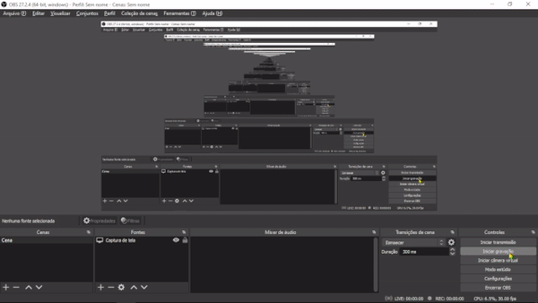

<h1 align="center">
   💻 ANIMEFLIX 💻
</h1>

<h4 align="center">
  💻Recriação do página inicial do Netflix com apenas animes!
</h4>

   
   <a href="#sobre">Sobre</a> .
   <a href="#roadmap">Roadmap</a> .
   <a href="#tecnologias">Tecnologias</a> .
   <a href="#fotos">Fotos</a> . 
   <a href="#autor">Autor</a>
 

   
 # Sobre 
     
     
   
 O projeto e com intuito de recriar a página inicial do Netflix, fiz algumas mudanças para ser somente animes. 
   dei vida ao botão de assistir para quando apertar ele abrir um vídeo sobre o que esta anunciando. 

   
   
   
   
   
   # Roadmap 
   
   
 O projeto e bastante tem com intuito recriar uma interface, assim consegui implementar do meu jeito oque eu queria
   utilizei algumas tecnologias para fazer carrosel de filmes. Visei tambem a responsividade assim podendo ser acessado por qualquer dispositivo!. 

   
   
   # Tecnologias 
   
   <h3 align="center"> Tecnolgias usadas no projeto </h3>
  
HTML

  
CSS

  
Java Script

  
JQuery 

   
   
   # Fotos 
   
   
   
   
   # Autor 
   
Ola, meu nome e Joao.   Me siga no <a href="https://www.linkedin.com/in/joao-soares-339642215/" target="_blank">Linkedin</a> para ver mais sobre os projeos que posto.!

