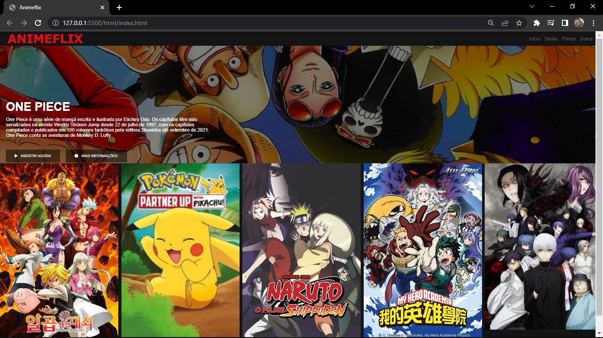

<h1 align="center">
   💻 ANIMEFLIX 💻
</h1>

<h4 align="center">
  😉 Recreation of the Netflix home page with only animes!
</h4>

   
   <a href="#on">On</a> .
   <a href="#roadmap">Roadmap</a> .
   <a href="#technologies">Technologies</a> .
   <a href="#photos">Photos</a> . 
   <a href="#author">Author</a>
 

   
 # On
     
     
   
 The project and in order to recreate the homepage of Netflix, I made some changes to be anime only.
   I gave life to the watch button so that when I press it, it opens a video about what is being announced. 

   
   
   
   
   
   # Roadmap 
   
   
The project is quite intended to recreate an interface, so I managed to implement what I wanted in my own way
   I used some technologies to make movie carousel. I also aimed at responsiveness so that it can be accessed by any device!.

   
   
   # Technologies
   
   <h3 align="center"> Technologies used in the project 🙃 </h3>

- [JavaScript](https://developer.mozilla.org/pt-BR/docs/Web/JavaScript) 
- [Html](https://developer.mozilla.org/pt-BR/docs/Web/HTML/Element/html/)  
- [CSS](https://developer.mozilla.org/pt-BR/docs/Web/CSS)  
- [JQuery](https://jquery.com/)  
   
   
   #  Photos
   
   
   
   
   # Author 
   
 Hello, my name is João.   Follow me on <a href="https://www.linkedin.com/in/jo%C3%A3o-soares13/" target="_blank">Linkedin</a> to see more about the projects I post.!

